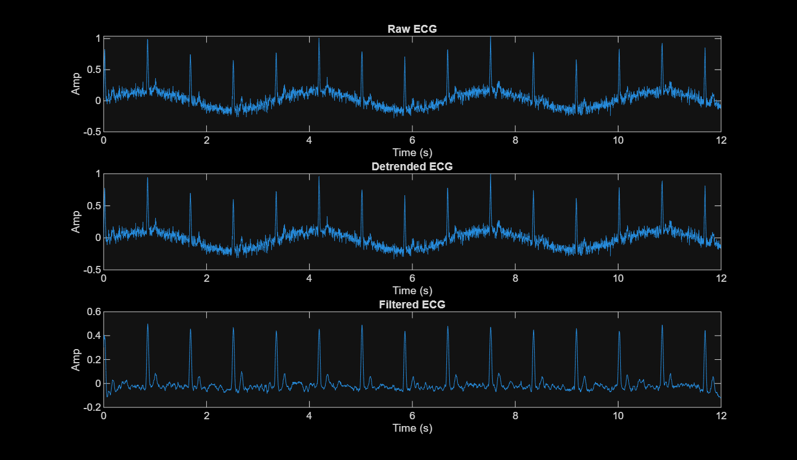
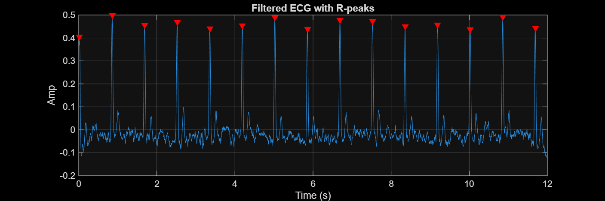
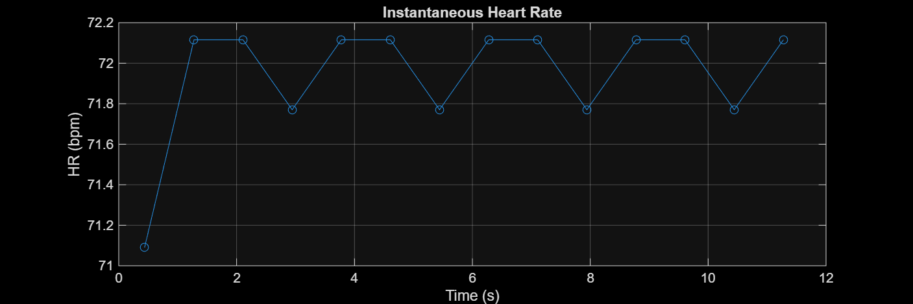

# MATLAB Biomedical Signal Processing — ECG/EEG

This repository contains a **MATLAB pipeline for ECG signal processing** with toolbox-free implementations, making it portable to any MATLAB installation.

---

##  Features
- Synthetic ECG generator (runs even if no data file is present)
- Bandpass filtering (Butterworth if available, fallback to moving-average)
- Optional 50/60 Hz notch filter
- R-peak detection (`findpeaks` if available, otherwise custom detector)
- Heart rate (HR) and HRV (SDNN, RMSSD) metrics
- Auto-saves plots and results to `/figs/`

---

##  Project Structure
matlab-ecg-analysis/
│
├── src/ # MATLAB scripts
│ └── ecg_pipeline.m # Main ECG processing pipeline
│
├── data/ # Place ECG files here (.mat with ecg, Fs or .csv with 'ecg')
│
├── figs/ # Auto-saved plots and results
│
├── my_first_script.m # Simple sine-wave demo
│
├── README.md # Project documentation
└── .gitignore


---

## Example Output

Below are sample plots generated by the pipeline:

- **Raw vs Filtered ECG**  
  

- **R-peaks Detected**  
  

- **Instantaneous Heart Rate**  
  

---

##  How to Run

1. Clone this repository:
   ```bash
   git clone https://github.com/LukThirion/Matlab-Biomedical-Signal-Processing-ECG-EEG-.git
   cd Matlab-Biomedical-Signal-Processing-ECG-EEG-/matlab-ecg-analysis
